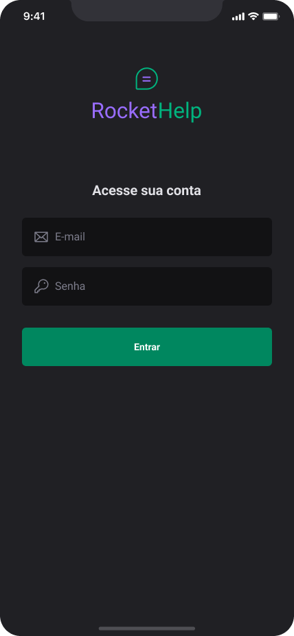
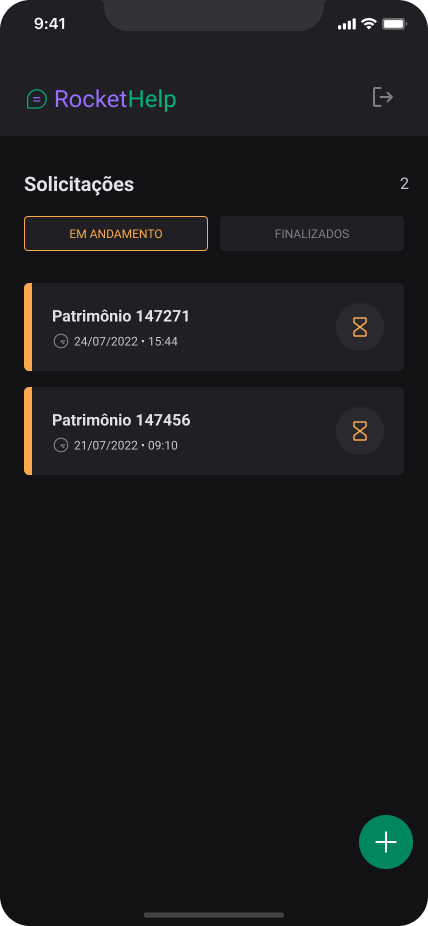
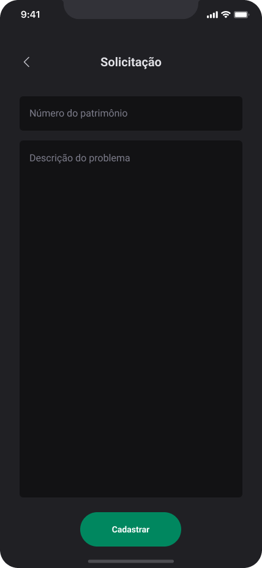
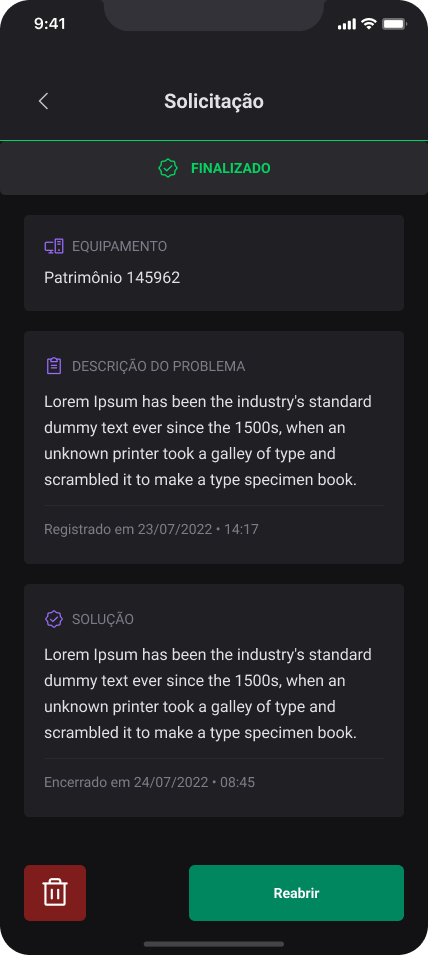

       
  

<h1 align="center">
  RocketHelp - Controle de solicitações de suporte
</h1>

       
  

<h4 align="center">
  Aplicativo desenvolvido durante o evento Ignite Lab | React Native da <a href="https://www.rocketseat.com.br">Rocketseat</a> de 17 a 20/07/2022
</h4>

  
  
  

  <a href="#-telas">Telas</a> •
  <a href="#-configuração-do-ambiente">Configuração do ambiente</a> • 
  <a href="#-tecnologias-utilizadas">Tecnologias</a> • 
  <a href="#-protótipo">Protótipo</a>

## 🎨 Telas

  
  
  
  
  
  
  

## 💻 Configuração do ambiente

Projeto criado com Expo. Veja a [documentação oficial](https://docs.expo.dev/get-started/installation/) para configurar.

### 🛠 Tecnologias utilizadas

- [React Native](https://reactnative.dev/)
- [React Native Firebase](https://rnfirebase.io)
- [React Navigation](https://reactnavigation.org/)
- [Native Base](https://nativebase.io/)
- [TypeScript](https://www.typescriptlang.org/)
- [Expo](https://docs.expo.dev)
- [Firebase](https://firebase.google.com/docs)

## 📄 Protótipo
- [Figma](https://www.figma.com/file/hBvQxaEdnjKJspMGA0SfYS/Rocket-Help---Evento-Ignite-Lab-%7C-React-Native?node-id=37%3A6)
